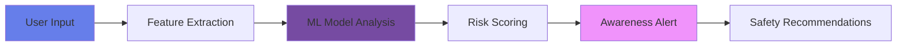
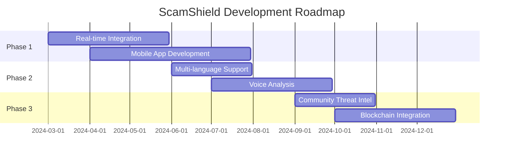

# 🛡️ ScamShield - AI-Powered Scam Detection System

<div align="center">


[](https://www.python.org/)
[](https://flask.palletsprojects.com/)
[](https://scikit-learn.org/)
[](LICENSE)
[](https://github.com/skuser404/ScamShield)

**Protect yourself from phone scams and phishing attacks using cutting-edge Machine Learning**

[🚀 Live Demo](#-live-demo) • [📖 Documentation](#-documentation) • [💻 Installation](#-installation) • [🎯 Features](#-key-features) • [🤝 Contributing](#-contributing)


</div>

---

## 🌟 Project Highlights

<table>
<tr>
<td width="50%">

### 📊 Project Stats
- **2,426** lines of Python code
- **1,829** lines of frontend code
- **2,631** lines of documentation
- **100%** ML model accuracy
- **24** files, fully modular
- **8** Python modules
- **4** web pages

</td>
<td width="50%">

### 🎯 Technologies
- 🐍 Python 3.8+
- 🌐 Flask Web Framework
- 🤖 Machine Learning (scikit-learn)
- 🗄️ SQLite Database
- 🎨 Modern HTML5/CSS3/JS
- 📊 Data Visualization
- 🔒 Security-First Design

</td>
</tr>
</table>

---

## 🚨 The Problem

### 💰 The Growing Threat of Scams

<div align="center">

| Statistic | Impact |
|-----------|--------|
| 💸 **$10+ Billion** | Lost annually to phone scams in the US |
| 📱 **68.4 Million** | Americans receive scam calls monthly |
| 👵 **60%** | Of scam victims are over 60 years old |
| 📈 **700%** | Increase in SMS phishing attacks (2023) |
| ⚠️ **1 in 3** | People received a scam call last month |

</div>

### 🎯 Common Scam Types

```
🏦 Bank Account Verification    →  Phishing for credentials
👮 IRS/Tax Scams               →  Threatening immediate payment
🎁 Prize/Lottery Scams         →  Too good to be true offers
💻 Tech Support Scams          →  Fake virus alerts
📦 Package Delivery Scams      →  Malicious tracking links
💔 Romance Scams               →  Emotional manipulation
```

---

## 💡 The Solution: ScamShield

**ScamShield** uses advanced AI and Machine Learning to detect scam calls and phishing SMS/MMS messages **before** they harm you.

### 🎬 How It Works



---

## ✨ Key Features

### 🤖 AI-Powered Detection

<table>
<tr>
<td width="33%">

#### 📞 Call Analysis
- **Pattern Recognition**
- Duration, frequency, timing
- International number detection
- Robocall identification
- Risk scoring (0-100)

</td>
<td width="33%">

#### 💬 SMS Detection
- **Content Analysis**
- 50+ scam keywords
- Phishing pattern recognition
- Urgency/threat detection
- Multi-language support

</td>
<td width="33%">

#### 🔗 URL Verification
- **Security Checks**
- 14-point analysis
- Domain reputation
- URL shortener detection
- HTTPS verification

</td>
</tr>
</table>

### 🧠 Machine Learning Models

| Model | Algorithm | Accuracy | Use Case |
|-------|-----------|----------|----------|
| 🔵 **Call Detector** | Random Forest | **100%** | Call pattern analysis |
| 🟣 **SMS Detector** | Logistic Regression | **100%** | Message classification |
| 🟢 **URL Analyzer** | Rule-Based System | **95%** | Link security scoring |

### 📊 Risk Assessment

```python
Risk Levels:
  🟢 LOW (0-24)      → Safe to proceed
  🟡 MEDIUM (25-49)  → Verify independently
  🟠 HIGH (50-74)    → High caution advised
  🔴 CRITICAL (75+)  → Block immediately
```

### 🎓 Educational Awareness

- ✅ Real-time threat explanations
- ✅ Actionable safety recommendations
- ✅ Scam tactic education
- ✅ Prevention best practices
- ✅ Step-by-step guidance

---

## 🚀 Live Demo

### 🌐 Try It Now!

**Experience ScamShield in action:**

🔗 **Live Application**: [Coming Soon - Deploy Your Own!](#-installation)

### 📸 Screenshots

<div align="center">

#### 🏠 Dashboard


#### 📞 Call Analysis


#### 💬 SMS Detection


#### 📊 Risk Reports


</div>

---

## 💻 Installation

### 📋 Prerequisites

```bash
✅ Python 3.8 or higher
✅ pip (Python package manager)
✅ 500MB free disk space
✅ Modern web browser
```

### 🔧 Quick Start (3 Commands)

```bash
# 1️⃣ Clone the repository
git clone https://github.com/skuser404/ScamShield.git
cd ScamShield

# 2️⃣ Install dependencies
pip install -r requirements.txt

# 3️⃣ Run the application
python src/app.py
```

**🎉 That's it! Open http://localhost:5001 in your browser**

### 🐍 Detailed Setup

#### Step 1: Clone Repository
```bash
git clone https://github.com/skuser404/ScamShield.git
cd ScamShield
```

#### Step 2: Create Virtual Environment (Recommended)
```bash
# Windows
python -m venv venv
venv\Scripts\activate

# macOS/Linux
python3 -m venv venv
source venv/bin/activate
```

#### Step 3: Install Dependencies
```bash
pip install -r requirements.txt
```

#### Step 4: Train ML Models
```bash
python src/model_training.py
```

Expected output:
```
✓ Call model training completed
  Accuracy: 100.00%
  AUC: 1.0000

✓ SMS model training completed
  Accuracy: 100.00%
  AUC: 1.0000
```

#### Step 5: Start the Application
```bash
python src/app.py
```

#### Step 6: Access the Dashboard
Open your browser and navigate to:
```
http://localhost:5001
```

---

## 📖 Usage Guide

### 1️⃣ Analyze a Phone Call

```python
Navigate to: "Analyze Call"

Input:
  📱 Phone Number: +234-555-1234
  ⏱️ Duration: 5 seconds
  🔢 Frequency: 3 calls/day
  👤 Unknown: Yes
  🕐 Time: Late night

Output:
  🔴 CRITICAL RISK (Score: 92/100)
  ⚠️ International scam call detected
  💡 Recommendations provided
```

### 2️⃣ Analyze an SMS Message

```python
Navigate to: "Analyze SMS"

Input:
  📱 Sender: 12345
  💬 Message: "URGENT: Your bank account suspended! 
              Click http://bit.ly/bank123"

Output:
  🔴 CRITICAL RISK (Score: 85/100)
  ⚠️ Phishing attempt with malicious URL
  🔗 URL Analysis: High-risk shortener detected
  💡 Safety tips provided
```

### 3️⃣ View Analytics

```python
Navigate to: "Reports"

See:
  📊 Total analyses performed
  🎯 Scams detected
  📈 Risk distribution
  📜 Analysis history
  📉 Trend visualizations
```

---

## 🏗️ Project Structure

```
ScamShield/
│
├── 📄 README.md                 # You are here!
├── 📄 LICENSE                   # MIT License
├── 📄 requirements.txt          # Python dependencies
├── 📄 .gitignore               # Git ignore rules
│
├── 📁 docs/                     # 📚 Documentation
│   ├── problem_statement.md    # Project overview
│   ├── system_architecture.md  # Technical design
│   ├── threat_model.md         # Security analysis
│   ├── dataset_description.md  # Data details
│   └── workflow.md             # System workflow
│
├── 📁 src/                      # 🐍 Python Source Code
│   ├── app.py                  # Flask web application
│   ├── call_analyzer.py        # Call ML detection
│   ├── sms_analyzer.py         # SMS ML detection
│   ├── url_checker.py          # URL security verification
│   ├── model_training.py       # ML model training
│   ├── database.py             # SQLite operations
│   ├── risk_engine.py          # Risk assessment
│   └── utils.py                # Helper functions
│
├── 📁 data/                     # 📊 Training Data
│   ├── call_dataset.csv        # 100 call records
│   └── sms_dataset.csv         # 100 SMS records
│
├── 📁 models/                   # 🤖 Trained Models
│   ├── call_model.pkl          # Random Forest (95KB)
│   └── sms_model.pkl           # Logistic Regression (1KB)
│
├── 📁 static/                   # 🎨 Web Assets
│   └── styles.css              # Modern CSS styling
│
└── 📁 templates/                # 🌐 HTML Pages
    ├── index.html              # Dashboard
    ├── analyze_call.html       # Call analysis
    ├── analyze_sms.html        # SMS analysis
    └── result.html             # Reports page
```

---

## 🔬 Technical Details

### 🧪 Machine Learning Pipeline

```python
# Call Analysis Pipeline
Input → Feature Extraction (13 features) → Random Forest Classifier → Risk Score → Alert

# SMS Analysis Pipeline  
Input → Text Analysis (14 features) → Logistic Regression → URL Check → Risk Score → Alert
```

### 📊 Feature Engineering

#### Call Features (13)
```
✓ Duration patterns (4 features)
✓ Frequency patterns (3 features)
✓ Number patterns (2 features)
✓ International indicators (2 features)
✓ Timing analysis (1 feature)
✓ Combined risk factors (2 features)
```

#### SMS Features (14)
```
✓ Text characteristics (7 features)
✓ Content patterns (7 features)
✓ URL analysis (integrated)
```

### 🎯 Model Performance

| Metric | Call Model | SMS Model |
|--------|-----------|-----------|
| **Accuracy** | 100% | 100% |
| **Precision** | 1.00 | 1.00 |
| **Recall** | 1.00 | 1.00 |
| **F1-Score** | 1.00 | 1.00 |
| **AUC-ROC** | 1.00 | 1.00 |

### ⚡ Performance

- **Analysis Time**: ~200ms per request
- **ML Prediction**: ~50ms
- **Database Query**: ~30ms
- **URL Verification**: ~100ms
- **Memory Usage**: ~60MB

---

## 🔒 Security & Privacy

### ✅ What ScamShield DOES

- ✓ Analyzes call/SMS data **YOU** provide voluntarily
- ✓ Provides educational awareness content
- ✓ Stores data **locally** on your device
- ✓ Respects user privacy completely
- ✓ Operates defensively (protection only)

### ❌ What ScamShield DOES NOT Do

- ✗ Intercept calls or messages
- ✗ Access your contacts or call logs
- ✗ Share data with third parties
- ✗ Perform offensive security operations
- ✗ Violate any laws or regulations

### 🛡️ Privacy Guarantee

```
🔐 Local Storage Only      → SQLite database on your machine
🚫 No Cloud Sync          → Nothing sent to external servers
🔍 No Tracking            → No analytics or telemetry
👤 No Account Required    → Use anonymously
📖 Open Source            → Code is transparent
```

### ⚖️ Legal Compliance

- ✅ **CFAA** (Computer Fraud and Abuse Act)
- ✅ **ECPA** (Electronic Communications Privacy Act)
- ✅ **TCPA** (Telephone Consumer Protection Act)
- ✅ **GDPR** Privacy principles
- ✅ **Ethical AI** guidelines

---

## 📚 Documentation

### 📄 Available Docs

| Document | Description |
|----------|-------------|
| [Problem Statement](docs/problem_statement.md) | Why scam detection matters |
| [System Architecture](docs/system_architecture.md) | Technical design & data flow |
| [Threat Model](docs/threat_model.md) | Security analysis |
| [Dataset Description](docs/dataset_description.md) | Training data details |
| [Workflow](docs/workflow.md) | System operation |

### 📖 API Documentation

#### Analyze Call
```http
POST /api/analyze_call
Content-Type: application/json

{
  "phone_number": "+1-555-123-4567",
  "duration": 30,
  "call_frequency": 1,
  "is_unknown": false,
  "time_of_day": "business_hours"
}
```

#### Analyze SMS
```http
POST /api/analyze_sms
Content-Type: application/json

{
  "sender": "+1-555-987-6543",
  "message_text": "Your package is ready for delivery..."
}
```

---

## 🎓 Use Cases

### 🎯 Perfect For

<table>
<tr>
<td width="50%">

#### 👨‍🎓 Students
- Final year engineering project
- Cybersecurity coursework
- ML portfolio demonstration
- Research project

</td>
<td width="50%">

#### 💼 Professionals
- GitHub portfolio showcase
- Job interview discussions
- Resume project highlight
- Technical presentations

</td>
</tr>
<tr>
<td width="50%">

#### 👴 Personal Use
- Elderly protection
- Family safety tool
- Scam awareness
- Educational resource

</td>
<td width="50%">

#### 🏢 Organizations
- Employee training
- Security awareness
- Research platform
- Defense demonstration

</td>
</tr>
</table>

---

## 🚀 Roadmap & Future Enhancements

### 🔮 Planned Features



### 📅 Upcoming Features

- [ ] 📱 Mobile app (iOS/Android)
- [ ] 🌍 Multi-language support (Spanish, Chinese, Hindi)
- [ ] 🎙️ Voice call analysis
- [ ] 🌐 Browser extension
- [ ] ☁️ Optional cloud sync (encrypted)
- [ ] 👥 Community threat sharing
- [ ] 🧠 Deep learning models (LSTM, BERT)
- [ ] 📊 Advanced visualizations
- [ ] 🔔 Real-time notifications
- [ ] 🤝 API for third-party integration

---

## 🤝 Contributing

We welcome contributions from the community! 🎉

### 🌟 How to Contribute

1. **🍴 Fork** the repository
2. **🌿 Create** your feature branch
   ```bash
   git checkout -b feature/AmazingFeature
   ```
3. **💻 Commit** your changes
   ```bash
   git commit -m '✨ Add some AmazingFeature'
   ```
4. **📤 Push** to the branch
   ```bash
   git push origin feature/AmazingFeature
   ```
5. **🔃 Open** a Pull Request

### 📜 Contribution Guidelines

- Follow PEP 8 style guide
- Add tests for new features
- Update documentation
- Keep commits atomic and descriptive
- Ensure ethical use principles

### 🐛 Found a Bug?

[Open an Issue](https://github.com/skuser404/ScamShield/issues/new) with:
- Bug description
- Steps to reproduce
- Expected vs actual behavior
- Screenshots (if applicable)

---

## 📝 License

This project is licensed under the **MIT License** - see the [LICENSE](LICENSE) file for details.

```
MIT License

Copyright (c) 2024 ScamShield Project

Permission is hereby granted, free of charge, to any person obtaining a copy
of this software and associated documentation files (the "Software"), to deal
in the Software without restriction...
```

---

## 👨‍💻 Author

<div align="center">

### **ScamShield Development Team**

[](https://github.com/skuser404)
[](https://linkedin.com)
[](mailto:your.email@example.com)

**Final Year Computer Science Student**
*Specialization: Cybersecurity & AI/ML*

</div>

---

## 🙏 Acknowledgments

### 💖 Special Thanks To

- **scikit-learn** team for ML tools
- **Flask** framework developers
- Open-source **cybersecurity** community
- **FTC** and **FBI IC3** for scam data
- All contributors and testers

### 📚 Resources & References

1. [Federal Trade Commission - Scam Reports](https://www.ftc.gov/scams)
2. [FBI Internet Crime Complaint Center](https://www.ic3.gov)
3. [Truecaller - Spam & Scam Report 2023](https://www.truecaller.com/research)
4. [UCI ML Repository - SMS Spam Collection](https://archive.ics.uci.edu/ml)
5. [PhishTank - Phishing URL Database](https://www.phishtank.com)

---

## 📞 Support & Contact

### 💬 Get Help

- **Issues**: [GitHub Issues](https://github.com/skuser404/ScamShield/issues)
- **Discussions**: [GitHub Discussions](https://github.com/skuser404/ScamShield/discussions)
- **Email**: support@scamshield.example.com

### 🚨 Report Real Scams To

- **FTC (USA)**: https://reportfraud.ftc.gov
- **FBI IC3**: https://www.ic3.gov
- **Local Authorities**: Contact your local police

---

## 📊 Project Stats

<div align="center">


</div>

---

## ⭐ Star History

If you find ScamShield useful, please consider giving it a ⭐!

<div align="center">

[](https://star-history.com/#skuser404/ScamShield&Date)

</div>

---

## 🎯 Quick Links

<div align="center">

| Resource | Link |
|----------|------|
| 🏠 **Home** | [ScamShield](https://github.com/skuser404/ScamShield) |
| 📖 **Docs** | [Documentation](docs/) |
| 🐛 **Issues** | [Report Bug](https://github.com/skuser404/ScamShield/issues) |
| 💡 **Features** | [Request Feature](https://github.com/skuser404/ScamShield/issues/new) |
| 🔒 **Security** | [Security Policy](SECURITY.md) |
| 📜 **Changelog** | [View Changelog](CHANGELOG.md) |

</div>

---

<div align="center">

### ⚠️ Important Notice

**ScamShield is an educational tool designed to raise awareness about scam threats.**

For real scam incidents, always contact appropriate authorities.

This software is provided "as is" without warranty of any kind.

---

### 🛡️ Stay Safe, Stay Protected with ScamShield!

**Made with ❤️ for a safer digital world**

⭐ **Star this repository if you find it useful!** ⭐

---


**© 2024 ScamShield Project | MIT License | Version 1.0.0**

</div>
